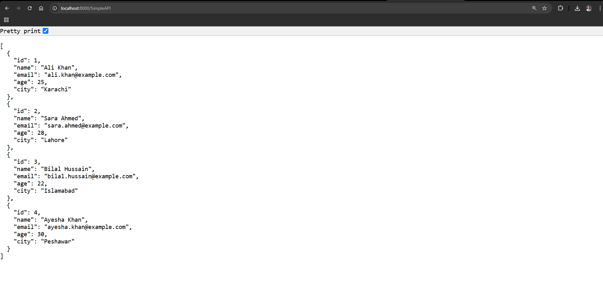
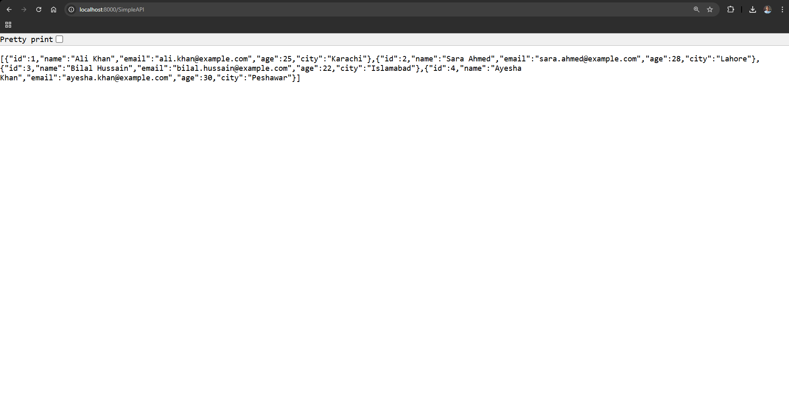
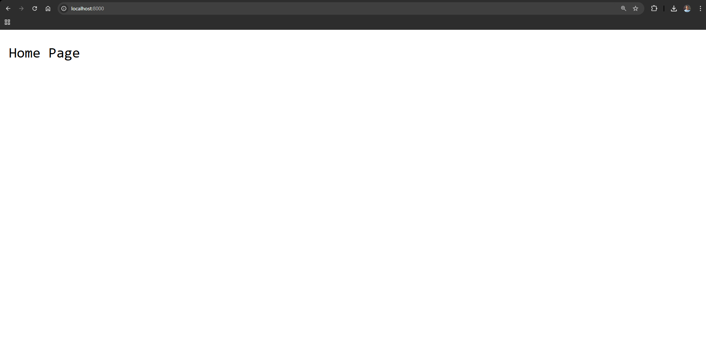

# Simple Node.js API
This repository contains a simple Node.js server that serves data from a JSON file through an API.

| Image 1 | Image 2 | Image 3 |
|---------|---------|---------|
|  |  |  |

---

---

## Features

- **Home Page**: Displays a simple "Home Page" message when accessed.
- **Simple API**: Fetches data from a `SimpleAPI.json` file and returns it as a JSON response.
- **Error Handling**: Displays a 404 error page for invalid routes and handles file reading errors.

---

